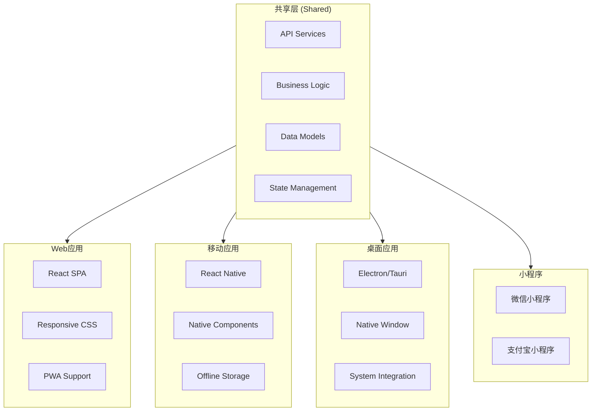

# AI背单词应用 - 多端适配技术方案

## 1. 多端适配总体策略

### 1.1 多端架构总览


### 1.2 多端适配方案对比

| 方案 | 开发成本 | 用户体验 | 维护成本 | 推荐度 |
|------|----------|----------|----------|--------|
| **响应式Web + PWA** | ⭐ 低 | ⭐⭐⭐⭐ | ⭐ 低 | ✅ 推荐 |
| **React Native** | ⭐⭐⭐ 中 | ⭐⭐⭐⭐⭐ | ⭐⭐ 中 | ⭐⭐ 可选 |
| **Electron桌面** | ⭐⭐ 中 | ⭐⭐⭐⭐ | ⭐⭐⭐ 高 | ⭐ 可选 |
| **微信小程序** | ⭐⭐ 中 | ⭐⭐⭐⭐ | ⭐⭐ 中 | ⭐ 特定场景 |

## 2. 方案一：响应式Web + PWA（核心方案）

### 2.1 响应式设计策略

#### 断点设计
```css
/* 移动优先设计 */
:root {
  /* Mobile: < 768px */
  --font-size-base: 14px;
  --spacing-unit: 8px;
  --card-padding: 16px;
  
  /* Tablet: 768px - 1024px */
  --breakpoint-tablet: 768px;
  
  /* Desktop: > 1024px */
  --breakpoint-desktop: 1024px;
  
  /* Wide: > 1440px */
  --breakpoint-wide: 1440px;
}

/* 响应式字体 */
@media (min-width: 768px) {
  :root {
    --font-size-base: 16px;
    --spacing-unit: 12px;
    --card-padding: 24px;
  }
}

@media (min-width: 1024px) {
  :root {
    --font-size-base: 17px;
    --spacing-unit: 16px;
    --card-padding: 32px;
  }
}
```

#### 布局策略
```typescript
// layouts/ResponsiveLayout.tsx
export const ResponsiveLayout = () => {
  const { isMobile, isTablet, isDesktop } = useBreakpoint();

  if (isMobile) {
    return <MobileLayout />;
  }

  if (isTablet) {
    return <TabletLayout />;
  }

  return <DesktopLayout />;
};

// 自定义断点Hook
export const useBreakpoint = () => {
  const [breakpoint, setBreakpoint] = useState<'mobile' | 'tablet' | 'desktop'>('desktop');

  useEffect(() => {
    const checkBreakpoint = () => {
      const width = window.innerWidth;
      if (width < 768) {
        setBreakpoint('mobile');
      } else if (width < 1024) {
        setBreakpoint('tablet');
      } else {
        setBreakpoint('desktop');
      }
    };

    checkBreakpoint();
    window.addEventListener('resize', checkBreakpoint);
    return () => window.removeEventListener('resize', checkBreakpoint);
  }, []);

  return {
    isMobile: breakpoint === 'mobile',
    isTablet: breakpoint === 'tablet',
    isDesktop: breakpoint === 'desktop',
  };
};
```

#### 组件响应式设计
```typescript
// components/WordCard.tsx
export const WordCard = () => {
  const { isMobile, isDesktop } = useBreakpoint();

  return (
    <div className={`
      ${isMobile ? 'w-full' : 'w-96'}
      ${isDesktop ? 'h-64' : 'h-56'}
      bg-white rounded-2xl shadow-lg p-${isMobile ? 4 : 6}
      transition-all duration-300
    `}>
      <h2 className={`
        ${isMobile ? 'text-2xl' : 'text-3xl'}
        font-bold text-gray-800
      `}>
        ephemeral
      </h2>
      
      {isDesktop && (
        <div className="flex gap-4 mt-4">
          <MeaningPanel />
          <ExamplesPanel />
        </div>
      )}
      
      {isMobile && (
        <Tabs defaultActiveKey="meaning">
          <Tab key="meaning" title="释义">
            <MeaningPanel />
          </Tab>
          <Tab key="examples" title="例句">
            <ExamplesPanel />
          </Tab>
        </Tabs>
      )}
    </div>
  );
};
```

### 2.2 PWA配置

#### manifest.json
```json
{
  "name": "AI背单词",
  "short_name": "词汇助手",
  "description": "智能AI背单词应用",
  "start_url": "/",
  "display": "standalone",
  "background_color": "#ffffff",
  "theme_color": "#1a365d",
  "orientation": "portrait-primary",
  "icons": [
    {
      "src": "/icons/icon-72x72.png",
      "sizes": "72x72",
      "type": "image/png"
    },
    {
      "src": "/icons/icon-192x192.png",
      "sizes": "192x192",
      "type": "image/png"
    },
    {
      "src": "/icons/icon-512x512.png",
      "sizes": "512x512",
      "type": "image/png"
    }
  ],
  "categories": ["education", "productivity"]
}
```

#### Service Worker
```typescript
// sw.ts
import { precacheAndRoute } from 'workbox-precaching';
import { registerRoute } from 'workbox-routing';
import { StaleWhileRevalidate, CacheFirst } from 'workbox-strategies';

precacheAndRoute(self.__WB_MANIFEST);

// 缓存API响应
registerRoute(
  ({ url }) => url.pathname.startsWith('/api/'),
  new StaleWhileRevalidate({
    cacheName: 'api-cache',
  })
);

// 缓存图片
registerRoute(
  ({ request }) => request.destination === 'image',
  new CacheFirst({
    cacheName: 'image-cache',
    plugins: [
      new ExpirationPlugin({
        maxEntries: 100,
        maxAgeSeconds: 30 * 24 * 60 * 60, // 30天
      }),
    ],
  })
);
```

### 2.3 离线功能
```typescript
// hooks/useOffline.ts
export const useOffline = () => {
  const [isOffline, setIsOffline] = useState(!navigator.onLine);

  useEffect(() => {
    const handleOnline = () => setIsOffline(false);
    const handleOffline = () => setIsOffline(true);

    window.addEventListener('online', handleOnline);
    window.addEventListener('offline', handleOffline);

    return () => {
      window.removeEventListener('online', handleOnline);
      window.removeEventListener('offline', handleOffline);
    };
  }, []);

  return isOffline;
};

// 离线数据同步
export const useOfflineSync = () => {
  const { syncWords, syncLearningRecords } = useSyncStore();

  useEffect(() => {
    if (!navigator.onLine) return;

    // 同步离线数据
    const syncData = async () => {
      await syncWords();
      await syncLearningRecords();
    };

    syncData();
  }, [navigator.onLine]);
};
```

## 3. 方案二：React Native移动端

### 3.1 项目结构
```
apps/
├── mobile/                    # React Native应用
│   ├── src/
│   │   ├── screens/          # 页面
│   │   │   ├── HomeScreen.tsx
│   │   │   ├── LearnScreen.tsx
│   │   │   ├── ReviewScreen.tsx
│   │   │   └── ProfileScreen.tsx
│   │   ├── components/       # 组件
│   │   │   ├── WordCard.tsx
│   │   │   ├── ProgressRing.tsx
│   │   │   └── Button.tsx
│   │   ├── navigation/      # 导航
│   │   │   └── AppNavigator.tsx
│   │   ├── services/        # API服务
│   │   │   └── api.ts
│   │   ├── hooks/           # 自定义Hook
│   │   ├── stores/          # 状态管理
│   │   └── utils/           # 工具函数
│   ├── android/
│   ├── ios/
│   └── package.json
```

### 3.2 核心组件
```typescript
// mobile/src/components/WordCard.tsx
import React from 'react';
import { View, Text, TouchableOpacity, StyleSheet } from 'react-native';
import Animated, { 
  useSharedValue, 
  useAnimatedStyle, 
  withSpring 
} from 'react-native-reanimated';

export const WordCard = ({ word, onFlip }) => {
  const scale = useSharedValue(1);

  const animatedStyle = useAnimatedStyle(() => ({
    transform: [{ scale: scale.value }],
  }));

  const handlePress = () => {
    scale.value = withSpring(0.95);
    setTimeout(() => {
      scale.value = withSpring(1);
      onFlip?.();
    }, 100);
  };

  return (
    <Animated.View style={[styles.card, animatedStyle]}>
      <TouchableOpacity onPress={handlePress} activeOpacity={0.9}>
        <Text style={styles.word}>{word.word}</Text>
        <Text style={styles.phonetic}>{word.phonetic}</Text>
        <Text style={styles.meaning}>{word.meaning}</Text>
      </TouchableOpacity>
    </Animated.View>
  );
};

const styles = StyleSheet.create({
  card: {
    backgroundColor: '#fff',
    borderRadius: 16,
    padding: 24,
    shadowColor: '#000',
    shadowOffset: { width: 0, height: 2 },
    shadowOpacity: 0.1,
    shadowRadius: 8,
    elevation: 4,
    margin: 16,
  },
  word: {
    fontSize: 32,
    fontWeight: 'bold',
    color: '#1a365d',
    marginBottom: 8,
  },
  phonetic: {
    fontSize: 18,
    color: '#718096',
    marginBottom: 16,
  },
  meaning: {
    fontSize: 18,
    color: '#2d3748',
    lineHeight: 28,
  },
});
```

### 3.3 移动端特有功能
```typescript
// mobile/src/hooks/useNotifications.ts
import { useEffect } from 'react';
import * as Notifications from 'expo-notifications';

export const useNotifications = () => {
  useEffect(() => {
    // 请求权限
    const requestPermissions = async () => {
      const { status } = await Notifications.requestPermissionsAsync();
      if (status !== 'granted') {
        console.log('Notification permission not granted');
      }
    };

    requestPermissions();

    // 设置通知处理
    Notifications.setNotificationHandler({
      handleNotification: async () => ({
        shouldShowAlert: true,
        shouldPlaySound: true,
        shouldSetBadge: true,
      }),
    });
  }, []);

  // 发送学习提醒
  const sendReviewReminder = async () => {
    await Notifications.scheduleNotificationAsync({
      content: {
        title: '⏰ 学习提醒',
        body: '您有单词需要复习啦，快来学习吧！',
        data: { type: 'review' },
      },
      trigger: {
        hour: 9,
        minute: 0,
        repeats: true,
      },
    });
  };
};
```

## 4. 方案三：桌面应用（Electron）

### 4.1 Electron配置
```typescript
// desktop/electron/main.ts
import { app, BrowserWindow } from 'electron';
import { createWindow } from './utils/window';

app.whenReady().then(() => {
  const mainWindow = createWindow({
    width: 1200,
    height: 800,
    minWidth: 800,
    minHeight: 600,
  });

  // 加载React应用
  mainWindow.loadURL('http://localhost:3000');

  // 开发模式下打开DevTools
  if (process.env.NODE_ENV === 'development') {
    mainWindow.webContents.openDevTools();
  }
});

// 窗口管理
export const createWindow = (options) => {
  const window = new BrowserWindow({
    ...options,
    webPreferences: {
      nodeIntegration: false,
      contextIsolation: true,
      preload: path.join(__dirname, 'preload.js'),
    },
    titleBarStyle: 'hiddenInset',
    frame: process.platform === 'darwin' ? true : false,
  });

  return window;
};
```

### 4.2 桌面端特有功能
```typescript
// desktop/src/features/systemIntegration.ts
import { ipcRenderer } from 'electron';

// 快捷键注册
export const registerGlobalShortcuts = () => {
  const { globalShortcut } = require('electron');

  globalShortcut.register('CommandOrControl+Shift+L', () => {
    ipcRenderer.send('open-learning-window');
  });
};

// 系统托盘
export const setupTray = () => {
  const { Tray, Menu, nativeImage } = require('electron');

  const tray = new Tray(nativeImage.createFromPath('icon.png'));

  const contextMenu = Menu.buildFromTemplate([
    {
      label: '打开应用',
      click: () => {
        ipcRenderer.send('show-window');
      },
    },
    {
      label: '快速学习',
      click: () => {
        ipcRenderer.send('open-learning-window');
      },
    },
    { type: 'separator' },
    {
      label: '退出',
      click: () => {
        app.quit();
      },
    },
  ]);

  tray.setToolTip('AI背单词');
  tray.setContextMenu(contextMenu);
};
```

## 5. 方案四：微信/支付宝小程序

### 5.1 项目结构
```
apps/
├── mini-program/
│   ├── miniprogram/
│   │   ├── pages/
│   │   │   ├── index/       # 首页
│   │   │   ├── learn/      # 学习页
│   │   │   ├── review/     # 复习页
│   │   │   └── profile/    # 个人中心
│   │   ├── components/     # 组件
│   │   ├── services/      # API
│   │   ├── utils/         # 工具
│   │   └── app.js
│   └── project.config.json
```

### 5.2 小程序API适配
```typescript
// mini-program/services/api.ts
const API_BASE = 'https://api.vocabapp.com';

export const request = (options) => {
  return new Promise((resolve, reject) => {
    wx.request({
      url: `${API_BASE}${options.url}`,
      method: options.method || 'GET',
      data: options.data,
      header: {
        'Content-Type': 'application/json',
        'Authorization': `Bearer ${wx.getStorageSync('token')}`,
      },
      success: (res) => {
        if (res.statusCode === 200) {
          resolve(res.data);
        } else {
          reject(res);
        }
      },
      fail: reject,
    });
  });
};

// 获取今日任务
export const getTodayTask = () => {
  return request({
    url: '/learning/today',
    method: 'GET',
  });
};

// 提交学习结果
export const submitLearning = (data) => {
  return request({
    url: '/learning/submit',
    method: 'POST',
    data,
  });
};
```

## 6. 共享层设计

### 6.1 共享类型定义
```typescript
// packages/shared/src/types/index.ts
export interface Word {
  id: string;
  word: string;
  phonetic: string;
  meaning: string;
  partOfSpeech: string;
  examples: string[];
  masteryLevel: 'NEW' | 'LEARNING' | 'MASTERED';
  nextReview?: Date;
}

export interface LearningResult {
  wordId: string;
  status: 'KNOWN' | 'FUZZY' | 'UNKNOWN';
  responseTime: number;
}

export interface User {
  id: string;
  name: string;
  email: string;
  dailyGoal: number;
  streak: number;
  wordsLearned: number;
}
```

### 6.2 共享API服务
```typescript
// packages/shared/src/api/client.ts
export class ApiClient {
  private baseUrl: string;
  private token?: string;

  constructor(baseUrl: string) {
    this.baseUrl = baseUrl;
  }

  setToken(token: string) {
    this.token = token;
  }

  async request<T>(endpoint: string, options?: RequestInit): Promise<T> {
    const headers: HeadersInit = {
      'Content-Type': 'application/json',
    };

    if (this.token) {
      headers['Authorization'] = `Bearer ${this.token}`;
    }

    const response = await fetch(`${this.baseUrl}${endpoint}`, {
      ...options,
      headers,
    });

    return response.json();
  }
}

// Web环境
export const webApi = new ApiClient(import.meta.env.VITE_API_URL);

// React Native环境
export const mobileApi = new ApiClient('https://api.vocabapp.com');
```

## 7. 多端部署策略

### 7.1 统一部署架构
```yaml
# docker-compose.yml
services:
  web:
    build: ./apps/client
    ports:
      - "3000:80"
    environment:
      - API_URL=https://api.vocabapp.com
    networks:
      - app-network

  api:
    build: ./apps/api
    ports:
      - "5000:5000"
    networks:
      - app-network

  # CDN用于静态资源
  cdn:
    image: nginx:alpine
    volumes:
      - ./static:/usr/share/nginx/html
    ports:
      - "8080:80"
    networks:
      - app-network
```

### 7.2 多端配置管理
```typescript
// config/platforms.ts
export const platformConfig = {
  web: {
    baseUrl: process.env.VITE_API_URL,
    pwa: true,
    analytics: true,
  },
  mobile: {
    baseUrl: 'https://api.vocabapp.com',
    pwa: false,
    analytics: true,
    deepLinking: true,
  },
  desktop: {
    baseUrl: 'http://localhost:5000',
    pwa: false,
    analytics: true,
    autoUpdate: true,
  },
  mini: {
    baseUrl: 'https://api.vocabapp.com',
    pwa: false,
    analytics: true,
  },
};
```

## 8. 推荐实施路线

### 阶段一：核心Web应用（1-2周）
1. ✅ 响应式布局设计
2. ✅ PWA支持（离线、推送通知）
3. ✅ 基础学习功能

### 阶段二：移动端优化（1周）
1. 移动端专项UI优化
2. 原生通知集成
3. 性能优化（启动速度、流畅度）

### 阶段三：桌面应用（可选，1周）
1. Electron封装
2. 系统集成（托盘、快捷键）
3. 自动更新

### 阶段四：小程序（可选）
1. 微信小程序适配
2. 支付宝小程序适配

## 9. 关键技术选型总结

| 平台 | 框架 | UI方案 | 状态管理 | 路由 |
|------|------|--------|----------|------|
| Web | React + Vite | Tailwind CSS | Zustand | React Router |
| Mobile | React Native | Native Components | Zustand | React Navigation |
| Desktop | Electron | Tailwind CSS | Zustand | React Router |
| Mini | Taro/UniApp | Taro UI | Taro Store | 适配层 |

## 10. 统一开发体验

### Monorepo管理
```json
// package.json
{
  "workspaces": [
    "apps/*",
    "packages/*"
  ],
  "scripts": {
    "dev:web": "cd apps/client && npm run dev",
    "dev:mobile": "cd apps/mobile && npm run start",
    "dev:desktop": "cd apps/desktop && npm run dev",
    "build:web": "cd apps/client && npm run build",
    "build:mobile": "cd apps/mobile && npm run build",
    "build:desktop": "cd apps/desktop && npm run build"
  }
}
```

通过这套方案，您可以实现：
- **一套代码，多端运行**：共享业务逻辑和类型定义
- **独立优化**：每个平台可以针对性优化用户体验
- **统一后端**：所有前端共享同一套API服务
- **灵活扩展**：可以随时添加新的平台支持
