# AI背单词应用 - 产品需求文档 (v2.0)

## 1. 产品概述

### 1.1 产品定位

**产品名称**：AI词汇大师

**产品标语**：智能记忆，让每个单词过目不忘

**一句话介绍**：一款融合AI技术的智能背单词应用，通过OpenRouter开源模型为用户提供个性化、智能化的英语词汇学习体验，支持App、小程序、公众号、Web全平台覆盖。

### 1.2 核心价值

- **AI智能记忆**：利用大模型生成个性化记忆口诀、联想故事，让单词记忆更有趣
- **科学遗忘曲线**：基于SM-2间隔重复算法，智能规划复习节奏
- **全平台覆盖**：一次学习，多端同步，随时随地背单词
- **沉浸式体验**：AI生成单词图片、真实语境例句，打造生动学习场景

### 1.3 目标用户

| 用户群体 | 特征描述 | 核心需求 |
|----------|----------|----------|
| **学生党** | 中学/大学生 | 应对考试（CET-4/6、考研、雅思、托福） |
| **职场人士** | 25-40岁 | 提升职场竞争力，出国旅行 |
| **英语爱好者** | 自学者 | 培养语感，拓宽视野 |
| **留学备考** | 申请海外院校 | 系统备考，高效记忆 |

### 1.4 市场价值

- **市场规模**：中国英语学习市场规模超1000亿元，背单词是刚需场景
- **趋势洞察**：AI+教育赛道持续火热，大模型赋能个性化学习
- **差异化**：竞品多为静态记忆，我们主打AI智能联想记忆

## 2. 用户需求分析

### 2.1 用户痛点

| 痛点 | 描述 | 解决方案 |
|------|------|----------|
| **记不住** | 单词重复记忆还是忘 | AI联想记忆 + 间隔重复 |
| **太枯燥** | 传统背单词无聊乏味 | 游戏化设计 + AI趣味内容 |
| **碎片化** | 时间零散难以坚持 | 多端支持 + 快速学习模式 |
| **不系统** | 词汇量提升缓慢 | 科学词库 + 学习路径规划 |
| **缺反馈** | 不知道掌握程度 | 智能测试 + 数据统计 |

### 2.2 用户故事

#### 故事1：张同学（大学生，CET-6备考）
> 作为一名大三学生，我每天在宿舍、教室、图书馆之间奔波。我希望在碎片时间用小程序快速复习几个单词，晚上回到宿舍再用App系统学习。AI生成的记忆口诀特别有趣，帮助我记住了很多难背的单词。

#### 故事2：李女士（职场白领，商务英语）
> 工作需要经常阅读英文邮件，我希望能快速提升商务词汇量。App的离线功能让我在地铁上也能学习，学习进度统计让我很有成就感。

#### 故事3：王同学（留学备考，雅思7分目标）
> 雅思词汇量要求很大，我需要系统高效的记忆方案。AI不仅帮我记单词，还给出真实语境例句，对写作和口语都很有帮助。

## 3. 产品功能规划

### 3.1 核心功能矩阵

| 功能模块 | 功能点 | 优先级 | 平台支持 |
|----------|--------|--------|----------|
| **学习引擎** |
| | 单词卡片展示 | P0 | 全部平台 |
| | AI记忆口诀生成 | P0 | 全部平台 |
| | AI例句生成 | P0 | App/小程序/Web |
| | AI联想图片生成 | P1 | App |
| | 三档反馈（认识/模糊/不认识） | P0 | 全部平台 |
| **复习系统** |
| | 智能复习队列 | P0 | 全部平台 |
| | 艾宾浩斯遗忘曲线 | P0 | 全部平台 |
| | 复习提醒通知 | P0 | App/小程序 |
| | 复习统计 | P0 | 全部平台 |
| **词库管理** |
| | 预设词库（CET-4/6、雅思、托福等） | P0 | 全部平台 |
| | 自定义词库 | P1 | App/Web |
| | 生词本 | P0 | 全部平台 |
| | 导入/导出 | P2 | App/Web |
| **用户激励** |
| | 学习连续天数 | P1 | 全部平台 |
| | 成就徽章系统 | P2 | 全部平台 |
| | 每日目标设定 | P1 | 全部平台 |
| | 学习排行榜 | P2 | 小程序 |
| **账号系统** |
| | 微信一键登录 | P0 | 全部平台 |
| | 跨平台数据同步 | P0 | 全部平台 |
| | 会员订阅 | P2 | App |
| **个人中心** |
| | 学习数据统计 | P0 | 全部平台 |
| | 学习设置 | P1 | 全部平台 |
| | 账号安全 | P1 | App/Web |

### 3.2 功能详细说明

#### 3.2.1 单词学习流程

```mermaid
flowchart TD
    A[进入学习] --> B[展示单词卡片]
    B --> C{查看详情}
    C -->|显示释义| D[AI生成记忆内容]
    C -->|查看例句| E[AI生成例句]
    C -->|查看图片| F[AI生成联想图]
    D --> G{选择反馈}
    E --> G
    F --> G
    G -->|认识| H[标记已掌握]
    G -->|模糊| I[加入短期复习]
    G -->|不认识| J[加入立即复习]
    H --> K{继续学习?}
    I --> K
    J --> K
    K -->|是| B
    K -->|否| L[生成学习报告]
```

#### 3.2.2 AI记忆内容示例

**单词**：ephemeral
**释义**：adj. 短暂的；瞬息的

**AI记忆口诀**：
> "e-费-m-灭-r-如-a-啊-l-了"：这个单词"费了灭如了啊"才记住，因为它代表"短暂的"美好时光！

**AI例句**：
1. Fasion trends are often ephemeral. 时尚潮流往往是短暂的。
2. The ephemeral beauty of cherry blossoms makes them more precious. 樱花短暂的美丽使它们更加珍贵。

**AI联想图**：展示一朵昙花一现的美丽花朵

### 3.3 平台功能差异

| 功能 | App | 小程序 | 公众号 | Web |
|------|-----|--------|--------|-----|
| 完整学习功能 | ✅ | ✅ | ✅ | ✅ |
| AI图片生成 | ✅ | ❌ | ❌ | ❌ |
| 离线学习 | ✅ | ❌ | ❌ | ✅ |
| 微信推送通知 | ✅ | ✅ | ✅ | ❌ |
| 微信支付 | ✅ | ❌ | ❌ | ❌ |
| 数据导出 | ✅ | ❌ | ❌ | ✅ |
| 批量导入单词 | ✅ | ❌ | ❌ | ✅ |

## 4. 商业模式

### 4.1 盈利模式

| 模式 | 说明 | 定价 |
|------|------|------|
| **基础版（免费）** | 每日10词学习，基础复习 | 免费 |
| **会员订阅** | 解锁全部词库、AI功能、离线学习 | ¥30/月、¥258/年 |
| **单词付费包** | 购买特定词库（如雅思核心词汇） | ¥9.9-39.9/个 |
| **企业版** | 批量用户管理、学习报告、数据分析 | ¥50/人/年 |

### 4.2 会员权益

| 权益 | 基础版 | 会员版 |
|------|--------|--------|
| 每日学习词数 | 10词 | 不限 |
| 词库范围 | CET-4基础 | 全部词库 |
| AI记忆口诀 | ✅ | ✅ |
| AI例句生成 | ✅ | ✅ |
| AI联想图片 | ❌ | ✅ |
| 离线学习 | ❌ | ✅ |
| 学习数据导出 | ❌ | ✅ |
| 专属学习计划 | ❌ | ✅ |

## 5. 竞品分析

### 5.1 主要竞品

| 竞品 | 定位 | 优势 | 劣势 |
|------|------|------|------|
| **百词斩** | 图形记忆 | 用户量大、图库丰富 | 记忆方法单一、缺乏AI |
| **扇贝单词** | 真实语境 | 例句真实、社区氛围 | UI较老旧、AI功能弱 |
| **不背单词** | 沉浸式学习 | 界面美观、词根词缀 | 记忆效率一般 |
| **墨墨背单词** | 抗遗忘 | 艾宾浩斯算法成熟 | 功能较单一 |

### 5.2 差异化策略

1. **AI驱动**：竞品多为静态记忆，我们用AI生成个性化内容
2. **全平台覆盖**：竞品主攻单一平台，我们实现真正的多端协同
3. **微信生态**：深度整合小程序+公众号，形成完整闭环

## 6. 项目里程碑

### 6.1 开发阶段

| 阶段 | 内容 | 目标时间 |
|------|------|----------|
| **Phase 1** | 后端API + 小程序MVP | 第1-4周 |
| **Phase 2** | App核心功能 | 第5-8周 |
| **Phase 3** | 公众号 + Web | 第9-10周 |
| **Phase 4** | 高级功能 + 会员系统 | 第11-12周 |
| **Beta** | 内测 + 优化 | 第13-14周 |
| **Launch** | 正式上线 | 第15周 |

### 6.2 上线后规划

| 时间 | 目标 | KPI |
|------|------|-----|
| 1个月 | MVP上线验证 | 注册用户10,000 |
| 3个月 | 功能完善迭代 | 日活1,000 |
| 6个月 | 商业化启动 | 付费用户500 |
| 12个月 | 稳定运营 | 注册用户100,000 |

## 7. 风险与对策

| 风险 | 等级 | 应对策略 |
|------|------|----------|
| AI生成内容质量不稳定 | 中 | 人工审核机制 + 用户反馈优化 |
| 微信政策变化 | 高 | 保持对微信生态的关注，及时调整 |
| 竞品快速复制 | 中 | 持续迭代，保持AI技术领先 |
| 用户增长放缓 | 中 | 运营活动 + 口碑传播 |
| 服务器成本上升 | 低 | 优化算法 + 分级缓存策略 |

## 8. 附录

### 8.1 术语表

| 术语 | 定义 |
|------|------|
| **艾宾浩斯遗忘曲线** | 描述人类记忆遗忘规律的曲线 |
| **间隔重复** | 基于遗忘曲线安排复习时间的学习方法 |
| **SM-2算法** | 经典的间隔重复计算算法 |
| **记忆口诀** | 帮助记忆的简短押韵句子 |
| **联想记忆** | 通过联想建立新记忆与已知信息的联系 |

### 8.2 文档版本

| 版本 | 日期 | 更新内容 |
|------|------|----------|
| v1.0 | 2024-01-15 | 初始版本 |
| v2.0 | 2024-01-20 | 增加微信生态、会员体系、商业模式 |
