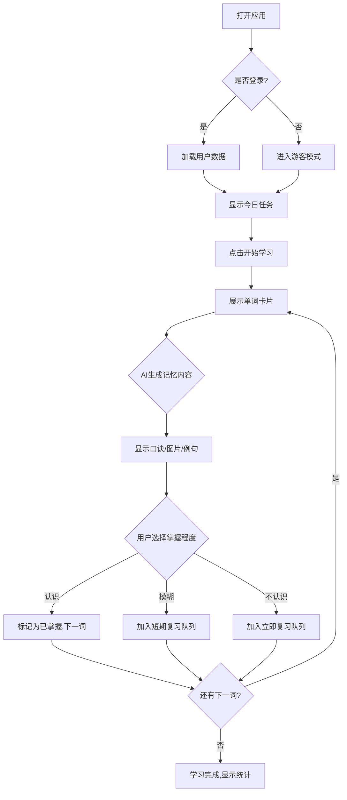
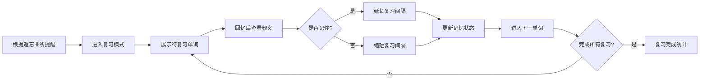

# AI背单词应用 - 产品需求文档

## 1. 产品概述

一款融合AI技术的智能背单词应用，通过OpenRouter API调用开源大模型，为用户提供个性化、智能化的英语词汇学习体验。支持多端访问（Web、移动端适配），让用户随时随地高效记忆单词。

### 核心价值
- **智能学习**：利用AI生成个性化记忆技巧和联想内容
- **科学记忆**：基于间隔重复算法优化复习节奏
- **多端同步**：支持Web和移动端，数据云端存储
- **趣味学习**：AI生成图片联想、例句、记忆口诀

## 2. 核心功能

### 2.1 用户角色
| 角色 | 注册方式 | 核心权限 |
|------|----------|----------|
| 游客用户 | 无需注册 | 体验基础功能，有限单词数 |
| 注册用户 | 邮箱/手机注册 | 完整功能，数据持久化 |

### 2.2 功能模块

#### 2.2.1 首页/仪表盘
- 今日学习进度展示（学习/复习单词数）
- 学习连续天数统计
- 快速开始学习按钮
- 推荐复习单词卡片
- 学习统计图表（周/月）

#### 2.2.2 单词学习模块
- **智能单词卡**：展示单词、音标、释义
- **AI联想记忆**：
  - AI生成记忆口诀/联想故事
  - AI生成单词相关图片
  - 例句展示
- **学习交互**：
  - 认识/模糊/不认识 三档选择
  - 下一单词按钮
  - 收藏单词功能

#### 2.2.3 单词本管理
- 词库选择（CET-4、CET-6、雅思、托福等）
- 自主添加生词
- 单词分类管理
- 导入/导出单词列表

#### 2.2.4 复习模块
- 基于艾宾浩斯遗忘曲线的智能复习计划
- 复习提醒设置
- 复习进度追踪

#### 2.2.5 个人中心
- 用户信息管理
- 学习数据统计
- 学习设置（每日目标、提醒时间等）
- 账号安全设置

## 3. 核心流程

### 3.1 学习主流程


### 3.2 复习流程


## 4. 用户界面设计

### 4.1 设计风格
- **设计理念**：现代简约 + 温暖亲和
- **主色调**：深蓝色 #1a365d（专业、可信）配合暖橙 #f6ad55（活力、温暖）
- **按钮风格**：圆角矩形，柔和阴影
- **字体**：
  - 标题：Poppins（现代几何感）
  - 正文：Noto Sans SC（清晰易读）
- **布局风格**：卡片式布局，清晰的信息层级
- **图标风格**：线性图标，简洁大方

### 4.2 页面设计概览

| 页面 | 模块名称 | UI元素 |
|------|----------|--------|
| 首页 | 进度卡片 | 圆形进度环、统计数字、渐变背景 |
| 学习页 | 单词卡片 | 大号单词居中、发音按钮、释义区、AI生成区 |
| 学习页 | 交互区 | 三档按钮、收藏按钮、进度指示器 |
| 词库页 | 词库选择器 | 标签式选择、CET/雅思/托福等分类 |
| 复习页 | 复习卡片 | 翻转动画、记忆状态指示 |

### 4.3 响应式设计
- **桌面端**：双栏布局，左侧导航，右侧内容
- **平板端**：自适应单栏，保持核心功能
- **移动端**：底部导航，触摸优化，大按钮易点击

## 5. 技术架构

### 5.1 技术选型
- **前端框架**：React 18 + TypeScript
- **构建工具**：Vite
- **样式方案**：Tailwind CSS
- **路由管理**：React Router v6
- **状态管理**：Zustand（轻量级）
- **数据持久化**：localStorage（本地存储）
- **AI集成**：OpenRouter API（free模型）

### 5.2 项目结构
```
/src
  /components     # 可复用组件
  /pages          # 页面组件
  /stores         # 状态管理
  /hooks          # 自定义Hook
  /services       # API服务
  /utils          # 工具函数
  /types          # TypeScript类型
  /data           # 静态数据
```

### 5.3 数据模型
```typescript
interface Word {
  id: string;
  word: string;
  phonetic: string;
  meaning: string;
  examples: string[];
  aiMemory?: string; // AI生成记忆内容
  aiImage?: string; // AI生成图片URL
  mastery: 'new' | 'learning' | 'mastered';
  nextReview: Date;
  reviewCount: number;
}

interface User {
  id: string;
  name: string;
  dailyGoal: number;
  streak: number;
  wordsLearned: number;
  wordsBook: Word[];
}
```
