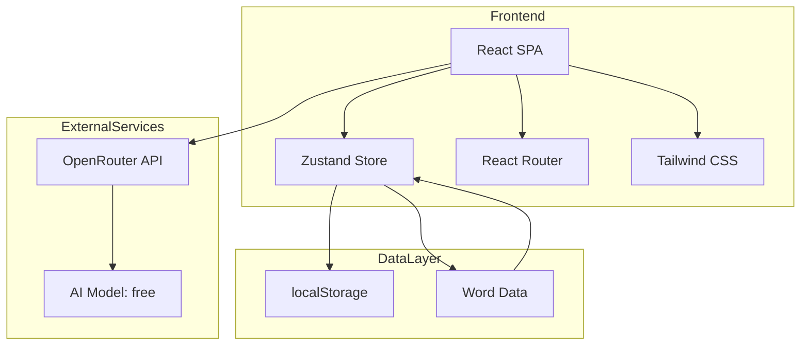

# AI背单词应用 - 技术架构文档

## 1. 架构设计

### 1.1 系统架构图


### 1.2 技术栈详情
| 层级 | 技术选型 | 说明 |
|------|----------|------|
| 前端框架 | React 18 | 组件化开发，生态成熟 |
| 类型系统 | TypeScript | 类型安全，开发体验好 |
| 构建工具 | Vite | 快速开发启动，热更新快 |
| 样式方案 | Tailwind CSS | 原子化CSS，快速开发 |
| 路由管理 | React Router v6 | SPA路由解决方案 |
| 状态管理 | Zustand | 轻量级，API简洁 |
| 数据存储 | localStorage | 本地持久化，无需后端 |
| AI服务 | OpenRouter API | 支持免费模型 |

## 2. 项目结构

```
/workspace
├── index.html
├── package.json
├── vite.config.ts
├── tailwind.config.js
├── tsconfig.json
├── .env.example              # 环境变量示例
└── src/
    ├── main.tsx              # 入口文件
    ├── App.tsx               # 根组件
    ├── index.css             # 全局样式
    ├── components/           # 可复用组件
    │   ├── ui/               # 基础UI组件
    │   │   ├── Button.tsx
    │   │   ├── Card.tsx
    │   │   └── Progress.tsx
    │   ├── layout/           # 布局组件
    │   │   ├── Sidebar.tsx
    │   │   └── MobileNav.tsx
    │   ├── WordCard.tsx      # 单词卡片
    │   ├── ProgressRing.tsx   # 进度环
    │   └── StatsChart.tsx    # 统计图表
    ├── pages/                # 页面组件
    │   ├── Home.tsx          # 首页/仪表盘
    │   ├── Learn.tsx         # 学习页面
    │   ├── Review.tsx         # 复习页面
    │   ├── Wordbook.tsx       # 词库管理
    │   └── Profile.tsx        # 个人中心
    ├── stores/               # 状态管理
    │   ├── userStore.ts      # 用户状态
    │   └── wordStore.ts      # 单词状态
    ├── services/             # API服务
    │   └── aiService.ts      # OpenRouter AI服务
    ├── hooks/                # 自定义Hook
    │   ├── useLocalStorage.ts
    │   └── useSpacedRepetition.ts
    ├── utils/                # 工具函数
    │   ├── storage.ts
    │   └── spacedRepetition.ts
    ├── types/                # TypeScript类型
    │   └── index.ts
    └── data/                 # 静态数据
        └── words.ts          # 初始单词库
```

## 3. 路由定义

| 路由 | 页面 | 功能描述 |
|------|------|----------|
| `/` | Home | 首页仪表盘，显示进度和统计 |
| `/learn` | Learn | 单词学习模块 |
| `/review` | Review | 复习模块 |
| `/wordbook` | Wordbook | 词库选择和管理 |
| `/profile` | Profile | 个人中心和设置 |

## 4. API定义

### 4.1 OpenRouter AI服务

```typescript
// 请求格式
interface AIRequest {
  model: string;          // "openrouter/free"
  messages: {
    role: "system" | "user" | "assistant";
    content: string;
  }[];
  max_tokens?: number;
  temperature?: number;
}

// 响应格式
interface AIResponse {
  id: string;
  choices: {
    message: {
      content: string;
    };
    finish_reason: string;
  }[];
  usage?: {
    prompt_tokens: number;
    completion_tokens: number;
    total_tokens: number;
  };
}
```

### 4.2 AI提示词模板

```typescript
// 记忆口诀生成
const MEMORY_PROMPT = `请为单词 "{word}" 生成一个简短有趣的记忆口诀/联想句子，帮助记忆这个单词及其意思"{meaning}"。要求：
1. 朗朗上口，易于记忆
2. 包含单词在生活中的应用场景
3. 限制在50字以内
4. 用中文回复`;

// 例句生成
const EXAMPLE_PROMPT = `请为单词 "{word}" 生成3个例句，要求：
1. 包含单词的准确使用
2. 句子难度适中
3. 用中文翻译解释
4. 每条限制在60字以内`;

// 图片生成提示词
const IMAGE_PROMPT = `Create a memorable, visually striking illustration that represents the word "{word}" meaning "{meaning}". Style: modern minimalist with warm colors. The image should help remember this vocabulary word.`;
```

## 5. 数据模型

### 5.1 核心数据结构

```typescript
// 单词实体
interface Word {
  id: string;
  word: string;              // 英文单词
  phonetic: string;          // 音标
  meaning: string;           // 中文释义
  partOfSpeech: string;      // 词性
  examples: string[];        // 例句
  aiMemory?: string;         // AI记忆口诀
  aiImage?: string;          // AI生成图片URL
  mastery: MasteryLevel;     // 掌握程度
  nextReview: number;       // 下次复习时间戳
  reviewCount: number;      // 复习次数
  lastReview?: number;      // 上次复习时间
  easeFactor: number;        // 间隔重复的难度因子
}

type MasteryLevel = 'new' | 'learning' | 'mastered';

// 用户数据
interface UserData {
  id: string;
  name: string;
  dailyGoal: number;         // 每日目标
  streak: number;            // 连续天数
  wordsLearned: number;      // 已学单词数
  wordsReviewed: number;     // 已复习单词数
  createdAt: number;         // 创建时间
  lastActive: number;        // 最后活跃时间
  settings: UserSettings;
}

interface UserSettings {
  dailyReminder: boolean;
  reminderTime: string;
  soundEnabled: boolean;
  theme: 'light' | 'dark';
}

// 学习记录
interface LearningRecord {
  wordId: string;
  status: 'known' | 'fuzzy' | 'unknown';
  timestamp: number;
  responseTime: number;      // 反应时间
}
```

### 5.2 localStorage存储键

| 键名 | 数据类型 | 描述 |
|------|----------|------|
| `vocab_user` | UserData | 用户数据 |
| `vocab_words` | Word[] | 用户单词本 |
| `vocab_records` | LearningRecord[] | 学习记录 |
| `vocab_settings` | UserSettings | 用户设置 |

## 6. 核心算法

### 6.1 间隔重复算法 (Spaced Repetition)

基于SM-2算法的简化版本：

```typescript
function calculateNextReview(word: Word, quality: number): number {
  // quality: 0-5 (0=完全忘记, 5=完全记住)
  let { easeFactor, interval, reviewCount } = word;

  if (quality < 3) {
    // 忘记：从1天开始
    interval = 1;
    reviewCount = 0;
  } else {
    if (reviewCount === 0) {
      interval = 1;
    } else if (reviewCount === 1) {
      interval = 6;
    } else {
      interval = Math.round(interval * easeFactor);
    }
    reviewCount++;
  }

  // 更新难度因子
  easeFactor = easeFactor + (0.1 - (5 - quality) * (0.08 + (5 - quality) * 0.02));
  easeFactor = Math.max(1.3, easeFactor);

  const nextReview = Date.now() + interval * 24 * 60 * 60 * 1000;
  return nextReview;
}
```

### 6.2 每日复习队列生成

```typescript
function getReviewQueue(words: Word[]): Word[] {
  const now = Date.now();
  return words
    .filter(word => word.nextReview <= now && word.mastery !== 'new')
    .sort((a, b) => a.nextReview - b.nextReview);
}
```

## 7. 环境配置

### 7.1 环境变量 (.env)

```env
VITE_OPENROUTER_API_KEY=your_api_key_here
VITE_OPENROUTER_BASE_URL=https://openrouter.ai/api/v1
VITE_APP_TITLE=AI背单词
```

### 7.2 OpenRouter配置

```typescript
const OPENROUTER_CONFIG = {
  baseUrl: import.meta.env.VITE_OPENROUTER_BASE_URL,
  apiKey: import.meta.env.VITE_OPENROUTER_API_KEY,
  model: 'openrouter/free',
  defaultMaxTokens: 500,
  defaultTemperature: 0.7,
};
```

## 8. 性能优化

### 8.1 图片加载策略
- AI生成图片使用懒加载
- 图片缓存到localStorage
- 提供占位图加载

### 8.2 API调用优化
- 批量生成记忆内容
- 防抖处理AI请求
- 请求缓存避免重复调用

### 8.3 状态管理优化
- Zustand选择器优化重渲染
- 合理拆分store
- 避免不必要的状态更新
