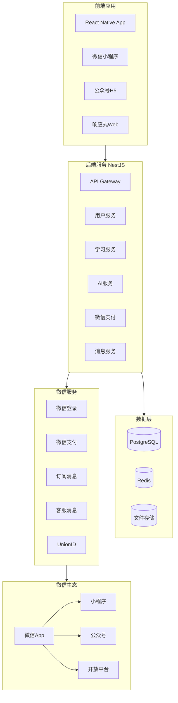
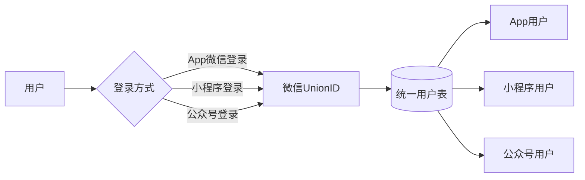

# AI背单词应用 - 微信生态系统技术方案

## 1. 微信生态系统总体架构

### 1.1 整体架构图


### 1.2 平台定位与功能

| 平台 | 定位 | 核心功能 | 用户场景 |
|------|------|----------|----------|
| **App** | 核心产品 | 完整功能、AI图片生成、离线学习、深度集成 | 高频用户、深度学习 |
| **小程序** | 轻量入口 | 快速学习、碎片时间、背单词 | 引流、新用户、低频用户 |
| **公众号** | 内容运营 | 学习提醒、内容推送、客服服务 | 用户触达、召回 |
| **Web** | 补充渠道 | 电脑端学习、数据查看 | 桌面场景 |

### 1.3 统一账户体系



**核心机制：微信UnionID**
- 同一个微信开放平台账号下的移动应用、公众号、小程序，用户的 UnionID 是唯一的
- 支持跨平台数据同步和用户识别

## 2. 项目结构设计

### 2.1 Monorepo架构
```
/workspace
├── apps/
│   ├── client/                    # 响应式Web应用
│   │   ├── src/
│   │   │   ├── components/
│   │   │   ├── pages/
│   │   │   ├── stores/
│   │   │   └── services/
│   │   └── package.json
│   │
│   ├── mobile/                    # React Native App
│   │   ├── src/
│   │   │   ├── screens/
│   │   │   ├── components/
│   │   │   ├── navigation/
│   │   │   ├── services/
│   │   │   └── utils/
│   │   ├── android/
│   │   ├── ios/
│   │   └── package.json
│   │
│   ├── mini-program/              # 微信小程序
│   │   ├── src/
│   │   │   ├── pages/
│   │   │   ├── components/
│   │   │   ├── services/
│   │   │   └── utils/
│   │   ├── miniprogram/
│   │   └── project.config.json
│   │
│   ├── official-account/           # 公众号H5
│   │   ├── src/
│   │   │   ├── pages/
│   │   │   ├── components/
│   │   │   └── services/
│   │   └── package.json
│   │
│   └── api/                        # NestJS后端
│       ├── src/
│       │   ├── modules/
│       │   │   ├── auth/
│       │   │   ├── user/
│       │   │   ├── word/
│       │   │   ├── learning/
│       │   │   ├── wechat/
│       │   │   └── ai/
│       │   ├── common/
│       │   ├── config/
│       │   └── prisma/
│       └── package.json
│
├── packages/
│   └── shared/                     # 共享包
│       ├── src/
│       │   ├── types/
│       │   ├── api/
│       │   ├── constants/
│       │   └── utils/
│       └── package.json
│
├── docker-compose.yml
└── .env.example
```

## 3. React Native App开发方案

### 3.1 项目初始化
```bash
# 创建React Native项目
npx @react-native-community/cli init AIMemorizer --skip-install

cd AIMemorizer

# 安装核心依赖
npm install \
  @react-navigation/native \
  @react-navigation/stack \
  @react-navigation/bottom-tabs \
  react-native-screens \
  react-native-safe-area-context \
  zustand \
  axios \
  @react-native-async-storage/async-storage

# 微信相关SDK
npm install \
  react-native-wechat-lib \
  @react-native-wechat/api

# AI相关
npm install \
  @anthropic/react-native \
  openai
```

### 3.2 App核心功能

#### 3.2.1 微信登录
```typescript
// apps/mobile/src/services/wechat.ts
import {微信} from 'react-native-wechat-lib';

export const wechatLogin = async () => {
  try {
    // 1. 唤起微信授权
    const authCode = await 微信.auth('snsapi_userinfo');

    // 2. 发送到后端获取UnionID
    const response = await api.post('/auth/wechat/app-login', {
      code: authCode.code,
      platform: 'app',
    });

    // 3. 保存Token
    await AsyncStorage.setItem('token', response.token);
    
    return response.user;
  } catch (error) {
    console.error('微信登录失败:', error);
    throw error;
  }
};
```

#### 3.2.2 离线学习功能
```typescript
// apps/mobile/src/services/offline.ts
import AsyncStorage from '@react-native-async-storage/async-storage';

interface OfflineWord {
  id: string;
  word: string;
  phonetic: string;
  meaning: string;
  examples: string[];
  aiMemory?: string;
  masteryLevel: string;
  nextReview?: number;
}

export const syncWordsOffline = async () => {
  // 获取今日任务
  const todayWords = await api.get('/learning/today');
  
  // 存储到本地
  await AsyncStorage.setItem(
    'offline_words',
    JSON.stringify(todayWords.data)
  );
  
  // 存储待复习单词
  const reviewWords = await api.get('/learning/review');
  await AsyncStorage.setItem(
    'offline_review',
    JSON.stringify(reviewWords.data)
  );
};

export const saveLearningResultOffline = async (
  wordId: string,
  status: string
) => {
  // 保存离线学习记录
  const records = await AsyncStorage.getItem('offline_records');
  const recordList = records ? JSON.parse(records) : [];
  
  recordList.push({
    wordId,
    status,
    timestamp: Date.now(),
    synced: false,
  });
  
  await AsyncStorage.setItem(
    'offline_records',
    JSON.stringify(recordList)
  );
};

export const syncOfflineData = async () => {
  const records = await AsyncStorage.getItem('offline_records');
  const recordList = records ? JSON.parse(records) : [];
  
  // 同步未上传的记录
  const unsynced = recordList.filter(r => !r.synced);
  
  for (const record of unsynced) {
    try {
      await api.post('/learning/submit', record);
      record.synced = true;
    } catch (error) {
      console.error('同步失败:', error);
    }
  }
  
  await AsyncStorage.setItem(
    'offline_records',
    JSON.stringify(recordList)
  );
};
```

#### 3.2.3 每日提醒通知
```typescript
// apps/mobile/src/services/notifications.ts
import notifee, { TriggerType, RepeatFrequency } from '@notifee/react-native';

export const scheduleReviewReminder = async (hour: number = 9, minute: number = 0) => {
  // 创建通知渠道
  await notifee.createChannel({
    id: 'learning-reminder',
    name: '学习提醒',
    description: '每日学习提醒通知',
  });

  // 设置定时提醒
  await notifee.createTriggerNotification(
    {
      title: '📚 学习提醒',
      body: '今天的学习任务还没完成哦，快来背单词吧！',
      android: {
        channelId: 'learning-reminder',
        pressAction: {
          id: 'default',
        },
      },
    },
    {
      type: TriggerType.TIMESTAMP,
      timestamp: getNextTriggerTime(hour, minute),
      repeatFrequency: RepeatFrequency.DAILY,
    }
  );
};

const getNextTriggerTime = (hour: number, minute: number): number => {
  const now = new Date();
  const trigger = new Date();
  trigger.setHours(hour, minute, 0, 0);
  
  if (trigger <= now) {
    trigger.setDate(trigger.getDate() + 1);
  }
  
  return trigger.getTime();
};
```

### 3.3 App特有功能

| 功能 | 说明 | 技术实现 |
|------|------|----------|
| **微信登录** | 一键授权登录 | react-native-wechat-lib |
| **微信支付** | 会员购买 | 微信支付SDK |
| **离线学习** | 无网也能学习 | AsyncStorage + 增量同步 |
| **AI图片** | 单词联想图片 | 调用AI接口本地缓存 |
| **推送通知** | 学习提醒 | 极光/个推 |
| **深链接** | 分享跳转 | App Links/Universal Links |

## 4. 微信小程序开发方案

### 4.1 项目初始化
```bash
# 使用Taro进行多端开发（推荐）
npx @tarojs/cli init AIMemorizerMini --template react

cd AIMemorizerMini

# 安装依赖
npm install \
  @tarojs/plugin-platform-weapp \
  @tarojs/plugin-framework-react \
  zustand \
  dayjs
```

### 4.2 小程序配置

#### project.config.json
```json
{
  "miniprogramRoot": "./dist/",
  "projectname": "AI背单词",
  "appid": "wx1234567890abcdef",
  "compileType": "miniprogram",
  "setting": {
    "urlCheck": false,
    "es6": true,
    "postcss": true,
    "minified": true
  },
  "libVersion": "2.25.0",
  "simulatorType": "wechat",
  "simulatorPluginLibVersion": {}
}
```

#### app.json
```json
{
  "pages": [
    "pages/index/index",
    "pages/learn/learn",
    "pages/review/review",
    "pages/wordbook/wordbook",
    "pages/profile/profile",
    "pages/login/login"
  ],
  "window": {
    "navigationBarTitleText": "AI背单词",
    "navigationBarBackgroundColor": "#1a365d",
    "navigationBarTextStyle": "white",
    "backgroundColor": "#f7fafc"
  },
  "tabBar": {
    "color": "#718096",
    "selectedColor": "#1a365d",
    "backgroundColor": "#ffffff",
    "borderStyle": "black",
    "list": [
      {
        "pagePath": "pages/index/index",
        "text": "首页"
      },
      {
        "pagePath": "pages/learn/learn",
        "text": "学习"
      },
      {
        "pagePath": "pages/wordbook/wordbook",
        "text": "词库"
      },
      {
        "pagePath": "pages/profile/profile",
        "text": "我的"
      }
    ]
  },
  "usingComponents": {},
  "sitemapLocation": "sitemap.json"
}
```

### 4.3 小程序核心功能

#### 4.3.1 微信登录
```typescript
// pages/login/login.ts
import { login as wxLogin, getUserProfile } from '@tarojs/taro';

Page({
  data: {
    canUseGetUserProfile: false,
  },

  async onLoad() {
    // 检查版本兼容性
    const canUse = Taro.canIUse('getUserProfile');
    this.setData({ canUseGetUserProfile: canUse });
  },

  async handleLogin() {
    try {
      // 1. 获取code
      const loginRes = await wxLogin();
      const code = loginRes.code;

      // 2. 获取用户信息（新版）
      const userRes = await getUserProfile({
        desc: '用于完善用户资料',
      });

      // 3. 发送到后端
      const response = await request.post('/auth/wechat/mini-login', {
        code,
        encryptedData: userRes.encryptedData,
        iv: userRes.iv,
      });

      // 4. 保存登录态
      Taro.setStorageSync('token', response.token);
      Taro.setStorageSync('userInfo', response.user);

      // 5. 跳转
      Taro.switchTab({ url: '/pages/index/index' });
    } catch (error) {
      Taro.showToast({
        title: '登录失败',
        icon: 'none',
      });
    }
  },
});
```

#### 4.3.2 学习页面
```typescript
// pages/learn/learn.ts
import { useLoad } from '@tarojs/taro';
import { useState } from 'react';
import { View, Text, Button } from '@tarojs/components';
import { request } from '../../services/api';
import './learn.scss';

export default function Learn() {
  const [currentWord, setCurrentWord] = useState(null);
  const [showAnswer, setShowAnswer] = useState(false);
  const [loading, setLoading] = useState(false);

  useLoad(() => {
    loadNextWord();
  });

  const loadNextWord = async () => {
    setLoading(true);
    try {
      const res = await request.get('/learning/next');
      setCurrentWord(res.data);
      setShowAnswer(false);
    } catch (error) {
      Taro.showToast({
        title: '加载失败',
        icon: 'error',
      });
    } finally {
      setLoading(false);
    }
  };

  const handleAnswer = async (status: 'KNOWN' | 'FUZZY' | 'UNKNOWN') => {
    if (!currentWord) return;

    try {
      await request.post('/learning/submit', {
        wordId: currentWord.id,
        status,
        responseTime: 2000,
      });

      // 加载下一个
      loadNextWord();
    } catch (error) {
      Taro.showToast({
        title: '提交失败',
        icon: 'error',
      });
    }
  };

  return (
    <View className="learn-container">
      {currentWord ? (
        <View className="word-card">
          <View className="word-text">{currentWord.word}</View>
          <View className="phonetic">{currentWord.phonetic}</View>
          
          {showAnswer ? (
            <>
              <View className="meaning">{currentWord.meaning}</View>
              {currentWord.aiMemory && (
                <View className="ai-memory">
                  <Text className="ai-icon">💡</Text>
                  <Text>{currentWord.aiMemory}</Text>
                </View>
              )}
              
              <View className="action-buttons">
                <Button 
                  className="btn unknown"
                  onClick={() => handleAnswer('UNKNOWN')}
                >
                  不认识
                </Button>
                <Button 
                  className="btn fuzzy"
                  onClick={() => handleAnswer('FUZZY')}
                >
                  模糊
                </Button>
                <Button 
                  className="btn known"
                  onClick={() => handleAnswer('KNOWN')}
                >
                  认识
                </Button>
              </View>
            </>
          ) : (
            <Button 
              className="show-answer"
              onClick={() => setShowAnswer(true)}
            >
              点击显示答案
            </Button>
          )}
        </View>
      ) : (
        <View className="empty-state">
          <Text>🎉 今日学习任务已完成！</Text>
          <Button onClick={() => Taro.switchTab({ url: '/pages/index/index' })}>
            返回首页
          </Button>
        </View>
      )}
    </View>
  );
}
```

#### 4.3.3 订阅消息
```typescript
// services/notification.ts
export const requestSubscribeMessage = async () => {
  // 小程序订阅消息
  const res = await Taro.requestSubscribeMessage({
    tmplIds: [
      '复习提醒模板ID',
      '学习完成模板ID',
    ],
  });

  if (res.errMsg === 'requestSubscribeMessage:ok') {
    console.log('订阅成功');
  }

  return res;
};

// 每日定时提醒
export const scheduleDailyReminder = () => {
  // 使用微信小程序的定时提醒功能
  Taro.setStorageSync('reminder_enabled', true);
  Taro.setStorageSync('reminder_time', '09:00');
};
```

### 4.4 小程序特有功能

| 功能 | 说明 | 限制 |
|------|------|------|
| **微信登录** | button组件触发 | 必须用户主动点击 |
| **订阅消息** | 学习提醒 | 需要用户授权 |
| **扫一扫** | 扫描背单词 | 需申请权限 |
| **分享** | 朋友圈/好友 | 单页分享 |
| **开放数据** | 好友排行 | 需解密 |

## 5. 微信公众号开发方案

### 5.1 公众号H5应用

#### 项目结构
```
apps/official-account/
├── src/
│   ├── pages/
│   │   ├── index/           # 首页
│   │   ├── learn/           # 学习页
│   │   ├── review/          # 复习页
│   │   └── profile/         # 个人中心
│   ├── components/
│   ├── services/
│   └── utils/
├── public/
│   └── jssdk/
└── package.json
```

#### 5.1.1 JSSDK配置
```typescript
// apps/official-account/src/utils/wx-jssdk.ts
import axios from 'axios';

declare global {
  interface Window {
    wx: any;
  }
}

export const initJSSDK = async () => {
  // 获取签名
  const { data } = await axios.post('/api/wechat/jssdk-config', {
    url: window.location.href.split('#')[0],
  });

  window.wx.config({
    debug: false,
    appId: data.appId,
    timestamp: data.timestamp,
    nonceStr: data.nonceStr,
    signature: data.signature,
    jsApiList: [
      'updateAppMessageShareData',    // 分享给朋友
      'updateTimelineShareData',      // 分享到朋友圈
      'chooseImage',                  // 选择图片
      'previewImage',                // 预览图片
      'getLocation',                // 获取位置
    ],
  });

  window.wx.ready(() => {
    console.log('JSSDK初始化成功');
  });

  window.wx.error((err: any) => {
    console.error('JSSDK初始化失败', err);
  });
};
```

#### 5.1.2 微信网页授权
```typescript
// apps/official-account/src/services/auth.ts
export const getWechatAuthUrl = (redirectUri: string, state: string = '') => {
  const appid = process.env.WECHAT_APPID;
  const scope = 'snsapi_userinfo'; // 需要用户授权
  // const scope = 'snsapi_base';   // 仅获取openid

  const params = new URLSearchParams({
    appid,
    redirect_uri: encodeURIComponent(redirectUri),
    response_type: 'code',
    scope,
    state: state || Math.random().toString(36).substring(7),
  });

  return `https://open.weixin.qq.com/connect/oauth2/authorize?${params}#wechat_redirect`;
};

export const handleAuthCallback = async (code: string) => {
  const response = await axios.post('/api/auth/wechat/official-login', {
    code,
    platform: 'official',
  });

  // 保存token
  localStorage.setItem('token', response.token);
  
  return response.user;
};
```

#### 5.1.3 分享功能
```typescript
// apps/official-account/src/components/ShareButton.tsx
export const ShareButton = ({ word }: { word: Word }) => {
  const shareToFriends = () => {
    window.wx.updateAppMessageShareData({
      title: `我来背单词：${word.word}`,
      desc: `意思是"${word.meaning}"，快来一起学习吧！`,
      link: `${window.location.origin}/share/${word.id}`,
      imgUrl: `${window.location.origin}/share-icon.png`,
    });
  };

  const shareToTimeline = () => {
    window.wx.updateTimelineShareData({
      title: `AI背单词挑战：${word.word}`,
      link: `${window.location.origin}/share/${word.id}`,
      imgUrl: `${window.location.origin}/share-icon.png`,
    });
  };

  return (
    <div className="share-buttons">
      <button onClick={shareToFriends}>分享给好友</button>
      <button onClick={shareToTimeline}>分享到朋友圈</button>
    </div>
  );
};
```

### 5.2 公众号自动回复

```typescript
// apps/api/src/modules/wechat/wechat.controller.ts
import { Controller, Post, Body, Get, Query } from '@nestjs/common';
import { WechatService } from './wechat.service';

@Controller('wechat')
export class WechatController {
  constructor(private readonly wechatService: WechatService) {}

  // 微信服务器验证
  @Get('validate')
  validate(@Query() query: { signature: string; timestamp: string; nonce: string; echostr: string }) {
    return this.wechatService.validateServer(query);
  }

  // 接收消息
  @Post('webhook')
  async handleMessage(@Body() body: any) {
    return this.wechatService.handleMessage(body);
  }

  // 获取JSSDK配置
  @Post('jssdk-config')
  getJSSDKConfig(@Body() body: { url: string }) {
    return this.wechatService.getJSSDKConfig(body.url);
  }
}
```

### 5.3 公众号特有功能

| 功能 | 说明 | 实现方式 |
|------|------|----------|
| **网页授权** | 获取用户信息 | OAuth2.0 |
| **JSSDK** | 分享、支付等 | 签名验证 |
| **模板消息** | 通知提醒 | 模板ID |
| **客服消息** | 用户咨询 | 客服接口 |
| **菜单配置** | 自定义菜单 | 菜单API |
| **数据分析** | 用户分析 | 数据统计API |

## 6. 后端微信服务集成

### 6.1 NestJS微信模块

```typescript
// apps/api/src/modules/wechat/wechat.module.ts
import { Module } from '@nestjs/common';
import { WechatController } from './wechat.controller';
import { WechatService } from './wechat.service';
import { HttpModule } from '@nestjs/axios';

@Module({
  imports: [HttpModule],
  controllers: [WechatController],
  providers: [WechatService],
  exports: [WechatService],
})
export class WechatModule {}

// apps/api/src/modules/wechat/wechat.service.ts
import { Injectable } from '@nestjs/common';
import axios from 'axios';
import * as crypto from 'crypto';

@Injectable()
export class WechatService {
  private readonly appId = process.env.WECHAT_APPID;
  private readonly appSecret = process.env.WECHAT_APPSECRET;
  private readonly token = process.env.WECHAT_TOKEN;

  // 获取AccessToken
  async getAccessToken(): Promise<string> {
    const cacheKey = 'wechat_access_token';
    const cached = await this.redis.get(cacheKey);
    
    if (cached) {
      return cached;
    }

    const response = await axios.get(
      'https://api.weixin.qq.com/cgi-bin/token',
      {
        params: {
          grant_type: 'client_credential',
          appid: this.appId,
          secret: this.appSecret,
        },
      },
    );

    const { access_token, expires_in } = response.data;
    
    // 缓存到Redis，提前5分钟过期
    await this.redis.setex(
      cacheKey,
      expires_in - 300,
      access_token,
    );

    return access_token;
  }

  // 小程序登录
  async miniLogin(code: string) {
    const response = await axios.get(
      'https://api.weixin.qq.com/sns/jscode2session',
      {
        params: {
          appid: this.appId,
          secret: this.appSecret,
          js_code: code,
          grant_type: 'authorization_code',
        },
      },
    );

    const { openid, unionid, session_key } = response.data;

    // 创建或更新用户
    const user = await this.prisma.user.upsert({
      where: { wechatOpenid: openid },
      update: { unionid },
      create: {
        wechatOpenid: openid,
        unionid,
        platform: 'mini',
      },
    });

    // 生成JWT
    const token = this.jwtService.sign({ id: user.id });

    return { token, user };
  }

  // 公众号登录
  async officialLogin(code: string) {
    // 获取OpenID
    const response = await axios.get(
      'https://api.weixin.qq.com/sns/oauth2/access_token',
      {
        params: {
          appid: this.appId,
          secret: this.appSecret,
          code,
          grant_type: 'authorization_code',
        },
      },
    );

    const { openid, unionid, access_token } = response.data;

    // 获取用户信息
    const userInfo = await axios.get(
      'https://api.weixin.qq.com/sns/userinfo',
      {
        params: { access_token, openid },
      },
    );

    // 创建或更新用户
    const user = await this.prisma.user.upsert({
      where: { wechatOpenid: openid },
      update: { 
        unionid,
        name: userInfo.data.nickname,
        avatar: userInfo.data.headimgurl,
      },
      create: {
        wechatOpenid: openid,
        unionid,
        name: userInfo.data.nickname,
        avatar: userInfo.data.headimgurl,
        platform: 'official',
      },
    });

    const token = this.jwtService.sign({ id: user.id });

    return { token, user };
  }

  // App微信登录
  async appLogin(code: string) {
    const response = await axios.get(
      'https://api.weixin.qq.com/sns/oauth2/access_token',
      {
        params: {
          appid: process.env.WECHAT_APP_APPID, // 移动应用AppID
          secret: process.env.WECHAT_APP_APPSECRET,
          code,
          grant_type: 'authorization_code',
        },
      },
    );

    const { openid, unionid } = response.data;

    // 使用UnionID创建/更新用户
    const user = await this.prisma.user.upsert({
      where: { unionid },
      update: { wechatAppOpenid: openid },
      create: {
        unionid,
        wechatAppOpenid: openid,
        platform: 'app',
      },
    });

    const token = this.jwtService.sign({ id: user.id });

    return { token, user };
  }

  // JSSDK签名
  async getJSSDKConfig(url: string) {
    const accessToken = await this.getAccessToken();

    // 获取jsapi_ticket
    const ticketResponse = await axios.get(
      'https://api.weixin.qq.com/cgi-bin/ticket/getticket',
      {
        params: { access_token: accessToken, type: 'jsapi' },
      },
    );

    const jsapiTicket = ticketResponse.data.ticket;
    const timestamp = Math.floor(Date.now() / 1000);
    const nonceStr = Math.random().toString(36).substring(7);

    // 签名
    const signature = crypto
      .createHash('sha1')
      .update(
        `jsapi_ticket=${jsapiTicket}&noncestr=${nonceStr}&timestamp=${timestamp}&url=${url}`,
      )
      .digest('hex');

    return {
      appId: this.appId,
      timestamp,
      nonceStr,
      signature,
    };
  }

  // 发送模板消息
  async sendTemplateMessage(
    openid: string,
    templateId: string,
    data: object,
    page?: string,
  ) {
    const accessToken = await this.getAccessToken();

    await axios.post(
      'https://api.weixin.qq.com/cgi-bin/message/template/send',
      {
        touser: openid,
        template_id: templateId,
        page,
        data,
      },
      {
        params: { access_token: accessToken },
      },
    );
  }

  // 服务器验证
  validateServer(query: {
    signature: string;
    timestamp: string;
    nonce: string;
    echostr: string;
  }) {
    const { signature, timestamp, nonce, echostr } = query;

    const arr = [this.token, timestamp, nonce].sort();
    const str = arr.join('');
    const sha1 = crypto.createHash('sha1').update(str).digest('hex');

    if (sha1 === signature) {
      return echostr;
    }
    return '';
  }
}
```

### 6.2 数据库用户表扩展

```prisma
model User {
  id               String   @id @default(uuid())
  unionid          String?  @unique  // 微信UnionID，用于跨平台识别
  wechatOpenid     String?  @map("wechat_openid")  // 公众号OpenID
  wechatAppOpenid  String?  @map("wechat_app_openid") // App OpenID
  wechatMiniOpenid String?  @map("wechat_mini_openid") // 小程序OpenID
  
  email            String?  @unique
  passwordHash     String?  @map("password_hash")
  name             String
  avatar           String?
  dailyGoal        Int      @default(20) @map("daily_goal")
  streak           Int      @default(0)
  wordsLearned     Int      @default(0) @map("words_learned")
  createdAt        DateTime @default(now()) @map("created_at")
  lastActive       DateTime @default(now()) @map("last_active")
  
  platform         String   @default('app')  // 主要使用平台

  wordBooks        WordBook[]
  learningRecords  LearningRecord[]
  userWords        UserWord[]

  @@map("users")
}
```

## 7. 跨平台数据同步

### 7.1 UnionID统一用户体系

```typescript
// apps/api/src/modules/user/user.service.ts
@Injectable()
export class UserService {
  async findOrCreateByUnionID(unionid: string, platformData: any) {
    let user = await this.prisma.user.findUnique({
      where: { unionid },
    });

    if (!user) {
      user = await this.prisma.user.create({
        data: {
          unionid,
          name: platformData.name || '微信用户',
          avatar: platformData.avatar,
          platform: platformData.platform,
        },
      });
    } else {
      // 更新平台信息
      const updateData: any = {};
      if (platformData.platform === 'app') {
        updateData.wechatAppOpenid = platformData.openid;
      } else if (platformData.platform === 'official') {
        updateData.wechatOpenid = platformData.openid;
      } else if (platformData.platform === 'mini') {
        updateData.wechatMiniOpenid = platformData.openid;
      }

      user = await this.prisma.user.update({
        where: { id: user.id },
        data: updateData,
      });
    }

    return user;
  }
}
```

### 7.2 学习进度同步

```typescript
// apps/api/src/modules/learning/learning.service.ts
@Injectable()
export class LearningService {
  async syncLearningData(userId: string, platformData: LearningData) {
    const user = await this.prisma.user.findUnique({
      where: { id: userId },
    });

    // 跨平台数据合并
    for (const wordData of platformData.words) {
      await this.prisma.userWord.upsert({
        where: {
          userId_wordId: {
            userId,
            wordId: wordData.wordId,
          },
        },
        update: {
          masteryLevel: wordData.masteryLevel,
          nextReview: wordData.nextReview,
          reviewCount: Math.max(
            wordData.reviewCount,
          ),
          easeFactor: wordData.easeFactor,
        },
        create: {
          userId,
          wordId: wordData.wordId,
          masteryLevel: wordData.masteryLevel,
          nextReview: wordData.nextReview,
          reviewCount: wordData.reviewCount,
          easeFactor: wordData.easeFactor,
        },
      });
    }

    return this.getStats(userId);
  }
}
```

## 8. 微信生态集成清单

### 8.1 需申请的权限

| 类型 | 权限 | 申请位置 |
|------|------|----------|
| **App** | 微信登录 | 微信开放平台 |
| **App** | 微信支付 | 微信支付商户平台 |
| **小程序** | 登录 | 微信公众平台 |
| **小程序** | 订阅消息 | 微信公众平台 |
| **公众号** | 网页授权 | 微信公众平台 |
| **公众号** | 模板消息 | 微信公众平台 |
| **公众号** | JSSDK | 微信公众平台 |

### 8.2 环境配置

```env
# .env
# 微信公众号
WECHAT_APPID=wx1234567890abcdef
WECHAT_APPSECRET=your_app_secret
WECHAT_TOKEN=your_token

# 微信小程序
WECHAT_MINI_APPID=wxabcdef1234567890
WECHAT_MINI_APPSECRET=your_mini_secret

# 微信App（移动应用）
WECHAT_APP_APPID=wx9876543210fedcba
WECHAT_APP_APPSECRET=your_app_secret

# 微信开放平台（UnionID）
WECHAT_OPEN_PLATFORM_APPID=wxopen1234567890
WECHAT_OPEN_PLATFORM_APPSECRET=your_open_secret
```

### 8.3 开发时间估算

| 阶段 | 功能 | 预计时间 |
|------|------|----------|
| 第一阶段 | 后端微信模块 | 3-5天 |
| 第二阶段 | React Native App | 2-3周 |
| 第三阶段 | 微信小程序 | 1-2周 |
| 第四阶段 | 公众号H5 | 1周 |
| 第五阶段 | 联调与优化 | 1周 |

## 9. 统一用户体验设计

### 9.1 跨平台UI一致性

```scss
// apps/official-account/src/styles/variables.scss
:root {
  --primary-color: #1a365d;
  --secondary-color: #f6ad55;
  --success-color: #48bb78;
  --warning-color: #ed8936;
  --error-color: #f56565;
  
  --font-family: -apple-system, BlinkMacSystemFont, 'Segoe UI', Roboto, 'Helvetica Neue', Arial, sans-serif;
  --border-radius: 8px;
  --card-shadow: 0 2px 8px rgba(0, 0, 0, 0.1);
}
```

### 9.2 平台适配策略

```typescript
// packages/shared/src/utils/platform.ts
export type Platform = 'app' | 'mini' | 'official' | 'web';

export const getPlatformConfig = (platform: Platform) => {
  const configs = {
    app: {
      apiBase: 'https://api.vocabapp.com',
      shareEnabled: true,
      pushEnabled: true,
      offlineEnabled: true,
    },
    mini: {
      apiBase: 'https://api.vocabapp.com',
      shareEnabled: true,
      pushEnabled: true,
      offlineEnabled: false,
    },
    official: {
      apiBase: 'https://api.vocabapp.com',
      shareEnabled: true,
      pushEnabled: false,
      offlineEnabled: false,
    },
    web: {
      apiBase: import.meta.env.VITE_API_URL,
      shareEnabled: true,
      pushEnabled: false,
      offlineEnabled: true,
    },
  };

  return configs[platform];
};
```

## 10. 推荐实施顺序

1. **后端微信模块** → 基础支撑
2. **微信小程序** → 快速验证，引流入口
3. **React Native App** → 核心产品
4. **公众号H5** → 用户触达和召回
5. **Web响应式** → 桌面补充

通过这套方案，您可以构建完整的微信生态系统，实现：
- 📱 App端：完整功能、深度集成、离线学习
- 🏪 小程序：轻量入口、便捷分享、低门槛使用
- 📢 公众号：内容运营、用户召回、客服服务
- 💻 Web端：桌面场景、数据管理

所有平台共享同一后端和用户数据，通过UnionID实现跨平台账户统一！
